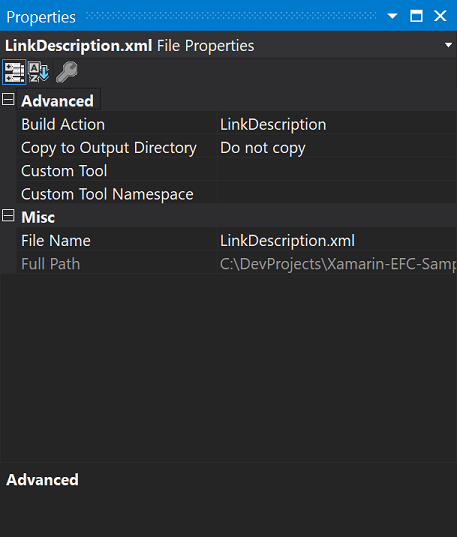

# Xamarin-EntityFrameworkCore-Sample

This is the Entity Framework Core sample app with Xamarin.Forms.

## Prerequisite

This sample app is created under the conditions:

- Visual Studio 2017
- Entity Framework Core version 2.1.4

## Remarks

This section is written to show some remarks for using Entity Framework Core in your Xamarin.Forms apps.

### Migration tool

You cannot call the migration tool (```dotnet ef```) in the Xamarin.Forms project directly. Therefore, you need to run the ```dotnet ef``` command via the .NET Core console app, which references the Xamarin project.


Under the directory of the console app, you can run the ```dotnet ef``` command.


After that, you can create the codes for migration of database.


### Build errors in the Xamarin.Android project

The build process of the Xamarin.Android project might failed in error as the following:

> Can not resolve reference: `System.Buffers`, referenced by `System.Memory`. Please add a NuGet package or assembly reference for `System.Buffers`, or remove the reference to `System.Memory`.

You can fix the error by adding ```System.Buffers``` NuGet package to your projects.

### Linker settings

You need to add the linker settings to your Android/iOS projects to avoid runtime error caused by linker. You can use xml file as the following:

```xml
<?xml version="1.0" encoding="utf-8" ?>
<linker>
  <assembly fullname="mscorlib">
    <type fullname="System.String">
      <method name="Compare"></method>
      <method name="CompareTo"></method>
      <method name="ToUpper"></method>
      <method name="ToLower"></method>
    </type>
  </assembly>
  <assembly fullname="System.Core">
    <type fullname="System.Linq.Expressions.Expression`1"></type>
    <type fullname="System.Linq.Queryable"></type>
  </assembly>
</linker>
```

Set the value of the ```Build Action``` property to ```LinkerDescripton```.



### Call ```SQLitePCL.Batteries_V2.Init()``` in initialization

If you want to use SQLite database, you have to add the initialization codes to your app.

```csharp
SQLitePCL.Batteries_V2.Init();
```
